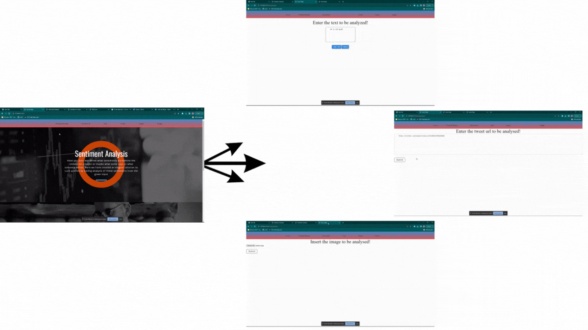

# SE Project 2

# C.E.L.T: The Sentimental Analyser is now C.E.L.T Pro! 

## Watch how our application works: 

[Youtube Video](https://youtu.be/V_F8zJv_IIg)  

## What is C.E.L.T?

Sentiment analysis is one of the fastest growing research areas in computer science, making it challenging to keep track of all the activities in the area. In our project we aim to achieve our goal in accurately predicting a users sentiment by analysing the data provided in any of the four different methods. They are Document Analysis, Text Analysis, Product Analysis, Tweet Analysis, Image Analysis and Audio Analysis. This document provides a major perspective for the users to understand and take up the project as an Open source software and add on multiple features before releasing to the market. Also, the document aids the developers in understanding the code and acts as a reference point for starting the project.

## PROJECT FLOW
1. The landing page on our website provides comprehensive information on various types of analyses, each with its respective link.
2. Once you have identified the specific type of analysis relevant to your needs, you will be directed to a form that accepts input for sentiment analysis.
3. The algorithm performs the analysis once you have provided the input and initiated the analysis. The results are presented in a variety of visual formats, including pie charts and bar graphs.
4. The output is segmented into three distinct categories, namely positive, neutral, and negative sentiments, each represented as a percentage. 
You can have a quick glance at some of our features through the gif below.  
We invite you to explore our comprehensive feature list by watching the detailed YouTube video we have provided.  

## CORE FEATURES
Here are our core features:
1. Text analysis (with enhanced accuracy in the latest version)
2. Document analysis
3. Tweet analysis (new feature)
4. Image analysis(new feature)
5. Audio analysis
6. Product review analysis
All of the above, now presented in a more user-friendly interface

## How is C.E.L.T Pro different from C.E.L.T? Read all about our feature additions and enhancements!
C.E.L.T Pro has undergone significant improvements that elevate this version to a higher level. Our team has meticulously designed and integrated a multitude of new features, both major and minor, to ensure that users of C.E.L.T Pro are provided with superior performance and functionality. 
# Major Enhancements 
1. Improved accuracy of text analysis: One of the critical changes we implemented was to improve the efficiency of the existing Text Analysis. As of our team started to analyze the features offered by the project, we noticed that the sentiment being analyzed from the input text that was provided had very low accuracy. Since Text Analysis one of the major features, there was a potential need to enhance its accuracy. We decided that the priority of this story would be high and enhanced the algorithm which is now being used by the project to give accurate sentiment of the input text. For instance, the previous version of C.E.L.T. had a tendency to misclassify certain text inputs, such as the phrase "not good," as positive. However, our current version of the software has been significantly improved in terms of accuracy and is now capable of addressing these and similar issues. 
2. Tweet Analysis: The second feature we worked on was to add the Tweet Analysis. This feature accept the url to the tweet as the input to be analyzed and returns the sentiment of the tweet after analyzing it. It can be found under the Tweet header in the UI and can also be accessed by the Tweet Analysis container in the Home page.
3. Image Analysis: The next enhancement was to add Image Analysis. This feature accepts the image [.jpg and .jpeg formats] as the input. It analyses the sentiment of the image and then return that as the output. This feature is made accessible under the Image Analysis container and also under the Image tab of the UI.  
# Minor Enhancements 
1. The User Interface was improved to make it more user-friendly. 
2. Changed the absolute path referencing that was being used to relative path to eliminate the path reconfiguration that the users had to perform earlier.
3. The requirements.txt file was modified to download the packages with the versions >= the ones being mentioned to enable forward compatibility. 
 

## Release Made in this cycle  
1. Critical release 1.0 - Included the priority fix to improve the accuracy of the text analysis along with the image and tweet analysis features.
2. Release 1.1 - Minor version release to make UI changes.
3. Release 2.0 - Included the minor enhancements and the fixes to the issues reported. 
[Read our detailed release notes](https://github.com/karthikmp5/C.E.L.T_pro/releases)  
 

The complete development was achieved using the following technologies: 
Python3  
Django 
HTML 
CSS 
Scrappy 
Vader Analysis Tool 
BeautifulSoup 
Textblob 
Our requirements file has all packages that will be required. For details on all packages that were used, we invite you to read [Requirements](https://youtu.be/VLoJCemCdHg](https://github.com/karthikmp5/C.E.L.T_pro/blob/Documentation/Update_readme/requirements.txt)

## Steps for execution
1. Run `pip install -r requirements.txt` followed by `python -c "import nltk; nltk.download('punkt'); nltk.download('stopwords')"`
2. Execute manage.py using the command `python3 manage.py runserver` at `/SE_Project1/sentimental_analaysis`. This runs the Django server such that we can open the webUI for the project on the browser.
3. Next, open your browser and type in `localhost:8000` in the search bar to open the webUI of the application.
4. You are now fully equipped to analyze sentiment across various data types, including text, documents, reviews, audio, images, and tweets.

## FUTURE SCOPE

Implement user authentication to store history for each user.

Recommendation system based on analysis results.

Live speech to text sentiment analysis.

Extend the analysis to the Facebook, Twitter and LinkedIn Posts

## Team Members

Annadurai,Harshitha  
Bhoja Ramamanohara,Pannaga Rao  
Masineni Prasanna Kumar,Karthik  
Niranjana,Prathima Putreddy  

## Support
Facing issues with the application? Mail us - [teamsoftwareeng7@gmail.com](teamsoftwareeng7@gmail.com)

				

